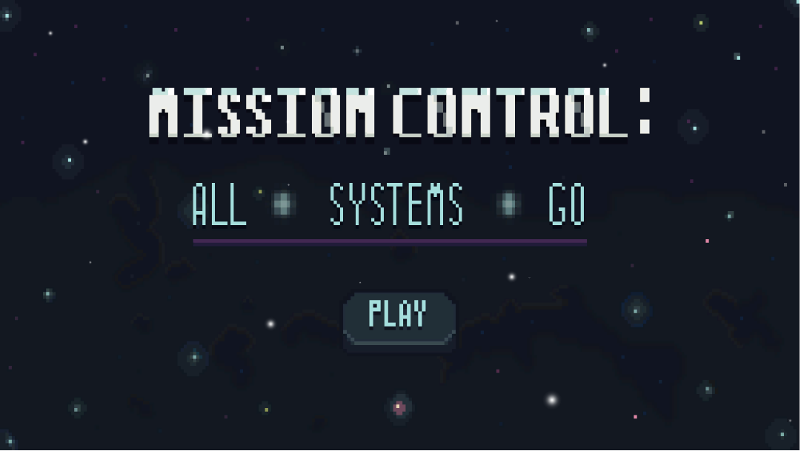

# Mission Control: All Systems Go
WebGL application sponsored by NASA's Pysche Mission for a capstone project. Game suite
that hosts a total of 4 mini-games, complete with custom pixel art and music.

**Link to Project:** https://jonac19.github.io/mission-control-game/

## Built With

- Unity
- C#
